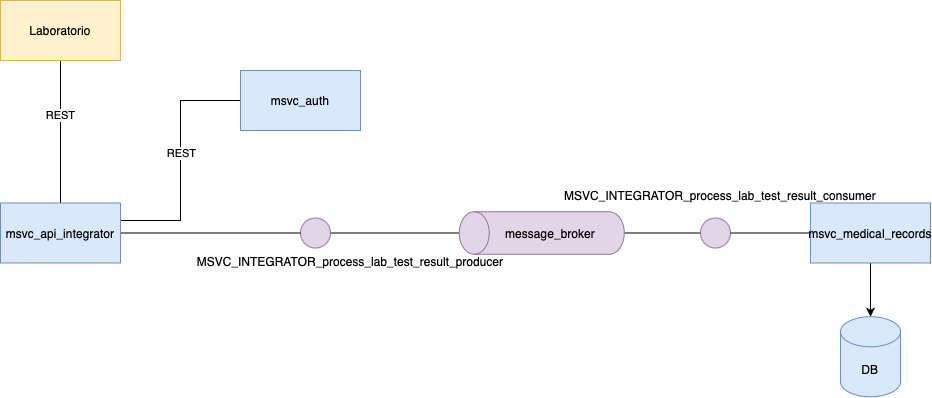

# MISW4406-aplicaciones-no-moniliticas

This experiment is about creating a microservices architecture for a medical system. The system is composed of two services: a medical record service and an integrator service. The medical record service is responsible for storing lab test results, and the integrator service is responsible for processing lab test results.

## Diagram



## Quality attributes to consider

* Latency: The system should be able to process lab test results in a timely manner.
* Availability: The system should be available 24/7.
* Easy to maintain: The system should be easy to maintain and update.


# Kubernetes (minikube) setup

This guide explains how to set up and test the RabbitMQ producer and consumer applications in Minikube.

## Prerequisites

- [Docker](https://docs.docker.com/get-docker/)
- [Minikube](https://minikube.sigs.k8s.io/docs/start/)
- [kubectl](https://kubernetes.io/docs/tasks/tools/)

## Project Structure

Create the following directory structure:

```
.
├── create-images.yml
├── deploy-all.sh
├── msvc-integrator-service
│   ├── Dockerfile
│   ├── k8s
│   │   ├── api-access.yaml
│   │   └── deployment.yaml
│   ├── requirements.txt
│   └── src
│       ├── __init__.py
│       ├── app.py
│       ├── commands
│       │   ├── __init__.py
│       │   └── process_lab_result_command.py
│       ├── config.py
│       ├── events
│       │   ├── __init__.py
│       │   └── lab_result_submitted_event.py
│       ├── handlers
│       │   ├── __init__.py
│       │   └── lab_result_handler.py
│       └── services
│           ├── __init__.py
│           └── rabbitmq_service.py
├── msvc-medical-record
│   ├── Dockerfile
│   ├── db_scripts
│   │   └── V1_0__create_lab_tests.sql
│   ├── k8s
│   │   ├── configmap.yaml
│   │   ├── deployment.yaml
│   │   └── service.yaml
│   ├── requirements.txt
│   └── src
│       ├── __init__.py
│       ├── app.py
│       ├── commands
│       │   ├── __init__.py
│       │   └── store_lab_test_command.py
│       ├── config.py
│       ├── consumers
│       │   ├── __init__.py
│       │   └── lab_test_consumer.py
│       ├── models
│       │   ├── __init__.py
│       │   └── lab_test.py
│       └── repositories
│           ├── __init__.py
│           └── lab_test_repository.py
├── rabbitmq
│   └── k8s
│       ├── config.yaml
│       ├── deployment.yaml
│       ├── persistent-volume.yaml
│       └── service.yaml
└── undeploy-all.sh
```

## Setup Steps

### 1. Start Minikube

```bash
minikube start
#minikube ssh
#docker images

./deploy-all.sh
```

You must configure a DB instance, and define a file (probably called `config.yaml`)
like the following one at the directory `postgres/k8s`:

```yaml
apiVersion: v1
kind: Secret
metadata:
  name: postgres-secret
type: Opaque
stringData:
  username: '?'
  password: '?'
  database: '?'
  host: '?'
  port: '?'

---
apiVersion: v1
kind: ConfigMap
metadata:
  name: postgres-config
data:
  POSTGRES_SSL_MODE: 'require'
  POSTGRES_CONNECTION_TIMEOUT: '30'
  POSTGRES_POOL_SIZE: '10'
```

This works for local development, if you wish to deploy to real env, you need to
define the artifact registry repo for the docker images, push them, and create a svc
account in GCP or your cloud provider to grant access to the pods in your cluster
to the images.

### Sending a test message

Use the postman collection.


# Experimentation results

[Experimentation results document](https://uniandes-my.sharepoint.com/:w:/g/personal/ea_silval1_uniandes_edu_co/EdtPIUjhA9hLqaC0azFJgYEBzYJfHx5I2eq_G6traAFyWg?e=mIcCXM)
